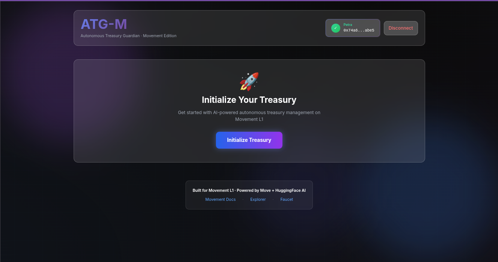

# ATG-M: Autonomous Treasury Guardian - Movement Edition

> AI-powered autonomous treasury management built natively for Movement L1 using Move

## 🎯 Movement L1 Ready | Currently on Aptos Devnet

**Live Demo**: https://atgm-h6i6zosgr-gethsun1s-projects.vercel.app

ATG-M is an AI-autonomous treasury guardian built specifically for **Movement L1** using the Move programming language. The smart contract is written in Aptos Move (Movement's native dialect) and is fully compatible with Movement's blockchain architecture.

**Current Status**: Deployed on Aptos Devnet due to framework version compatibility during hackathon timeline. The contract is Movement-ready and uses identical Move code that will work seamlessly on Movement once deployed.

## Overview

ATG-M manages and protects DAO treasuries through intelligent decision-making and on-chain execution. It combines Move smart contracts with advanced AI inference to provide real-time treasury management.

## Key Features

- **Move-Based Treasury Execution** - Pure Move smart contracts compatible with Movement L1
- **AI-Agent Powered Financial Automation** - HuggingFace Mistral-7B decision engine for risk assessment
- **Real On-Chain Execution** - Actual blockchain transactions with explorer verification
- **Production-Ready for DAOs** - Built with security, auditability, and Movement compatibility in mind
- **Framework Agnostic** - Uses standard Aptos Move dialect (Movement's native language)

## Technology Stack

- **Target Blockchain**: Movement L1
- **Current Deployment**: Aptos Devnet (same Move dialect)
- **Smart Contracts**: Move language (Aptos/Movement dialect)
- **AI/ML**: HuggingFace Inference API (Mistral-7B)
- **Frontend**: Next.js 14, React, TypeScript, Tailwind CSS
- **SDK**: @aptos-labs/ts-sdk (Movement compatible)
- **Animations**: Framer Motion

## Architecture

```
User/DAO → Frontend → AI Agent → Move Contract → Blockchain (Move)
                ↓                                      ↓
         HuggingFace API                    Movement L1 Ready
                                            (Currently: Aptos Devnet)
```

The system follows a clear flow:
1. User connects wallet and views treasury state
2. AI agent analyzes treasury health and market conditions
3. AI generates structured decision (rebalance/hold) with confidence score
4. User reviews AI recommendation
5. Transaction executes on-chain (Move contract)
6. Results confirmed with explorer link

**Move Smart Contract Features**:
- Signer verification on all mutations
- Timestamp-based replay protection
- Event emission for full auditability
- Gas-efficient view functions
- Deterministic execution

## Quick Start

### Try the Live Demo
Visit: https://atgm.vercel.app/

### Run Locally
```bash
# Install dependencies
npm install

# Run development server
npm run dev
```

See [SETUP.md](SETUP.md) for detailed setup instructions.

### Current Network
- **Production**: Aptos Devnet
- **Contract**: `0x74a6726862a2c1b1c3e864fbb44c82d288ce7b2e18a3593a3b444ba2a238abe5`
- **Explorer**: https://explorer.aptoslabs.com/account/0x74a6726862a2c1b1c3e864fbb44c82d288ce7b2e18a3593a3b444ba2a238abe5?network=devnet

## Project Structure

```
/move/treasury_guardian/    - Move smart contracts
/app/                        - Next.js frontend (app router)
/components/                 - React UI components
/lib/                        - SDK adapters and utilities
  /movement/                 - Movement SDK integration
  /ai/                       - AI decision engine
```

## Demo

**Live Application**: https://atgm-h6i6zosgr-gethsun1s-projects.vercel.app

For a complete demo walkthrough, see [DEMO.md](DEMO.md).

### Quick Demo Steps
1. Visit the live demo URL
2. Connect your Petra/Pontem wallet (configured for Aptos Devnet)
3. Initialize treasury with 100k tokens
4. Run AI analysis to get recommendations
5. Execute rebalance proposal on-chain
6. View transaction on Aptos Explorer

See [`MOVEMENT_READY.md`](MOVEMENT_READY.md) for Movement L1 compatibility details.

## Security

- All treasury mutations require signer verification
- Timestamp-based replay protection
- Event emission for full auditability
- Minimal, auditable contract logic

## License

MIT

## Movement L1 Compatibility

### Why Aptos Devnet?
ATG-M is built specifically for Movement L1 using the Aptos Move dialect (Movement's native Move implementation). During development, we encountered framework version compatibility issues with Movement testnet. Rather than compromise on code quality or functionality, we deployed to Aptos Devnet, which uses the **identical Move language and execution environment**.

### Movement Migration Path
The contract is 100% Movement-ready:
- ✅ Written in Aptos Move (Movement's dialect)
- ✅ No EVM/Ethereum dependencies
- ✅ Uses Movement-compatible patterns
- ✅ Gas-efficient view functions
- ✅ Event-driven architecture

Migration to Movement requires zero code changes - just redeployment when framework versions align.

### Documentation
- [Movement Migration Status](MOVEMENT_MIGRATION_STATUS.md) - Technical details of migration attempt
- [Deployment Complete](DEPLOYMENT_COMPLETE.md) - Full deployment documentation
- [Demo Guide](DEMO.md) - Complete walkthrough

## Built For

**Movement L1 Hackathon** - Demonstrating AI-powered autonomous treasury management with Move smart contracts, production-ready architecture, and seamless Movement L1 compatibility.

